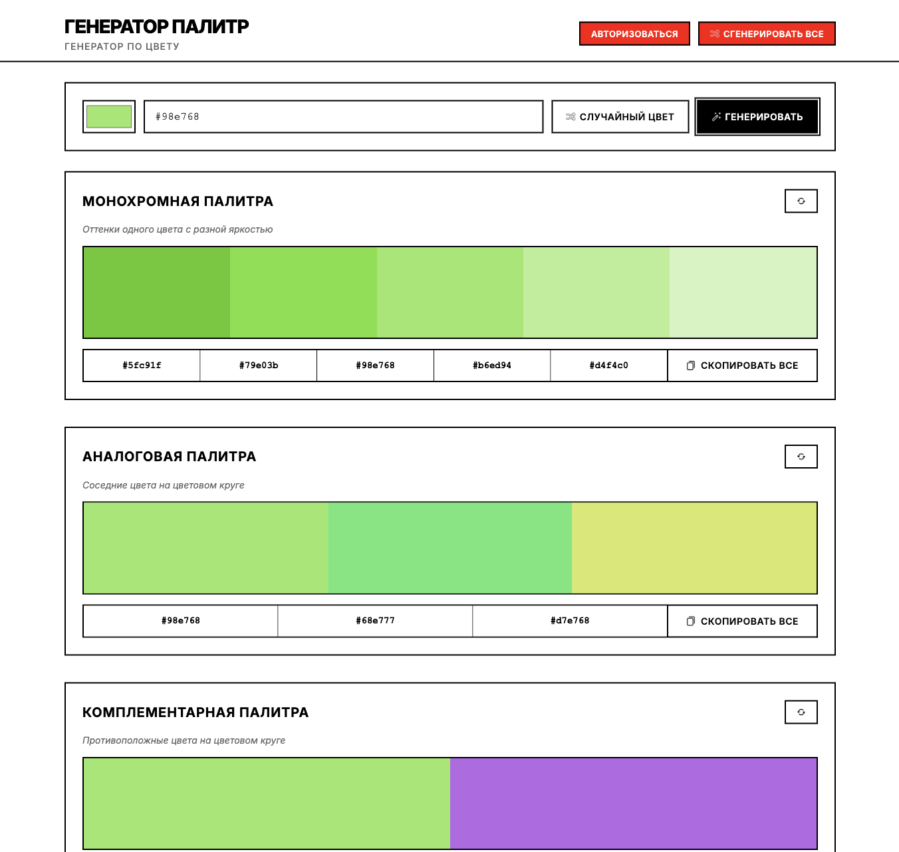
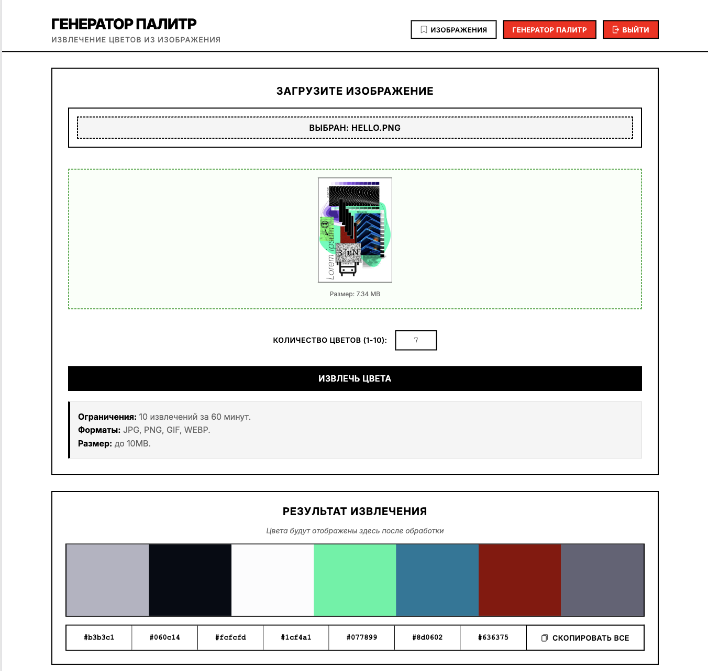
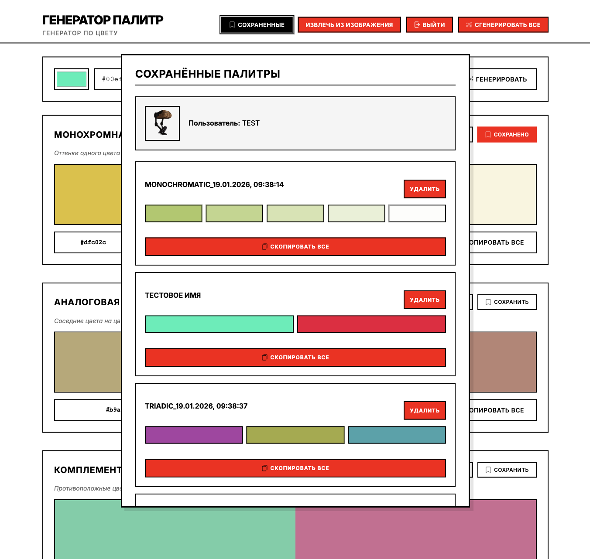
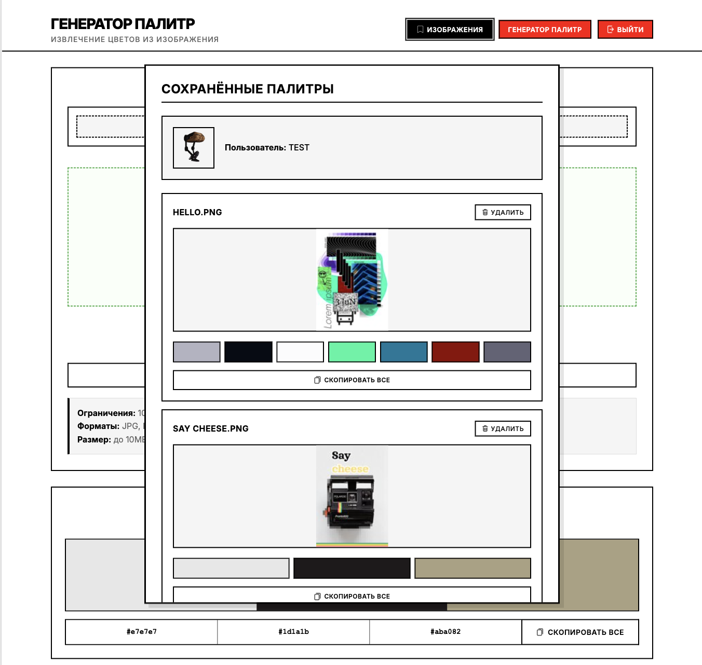
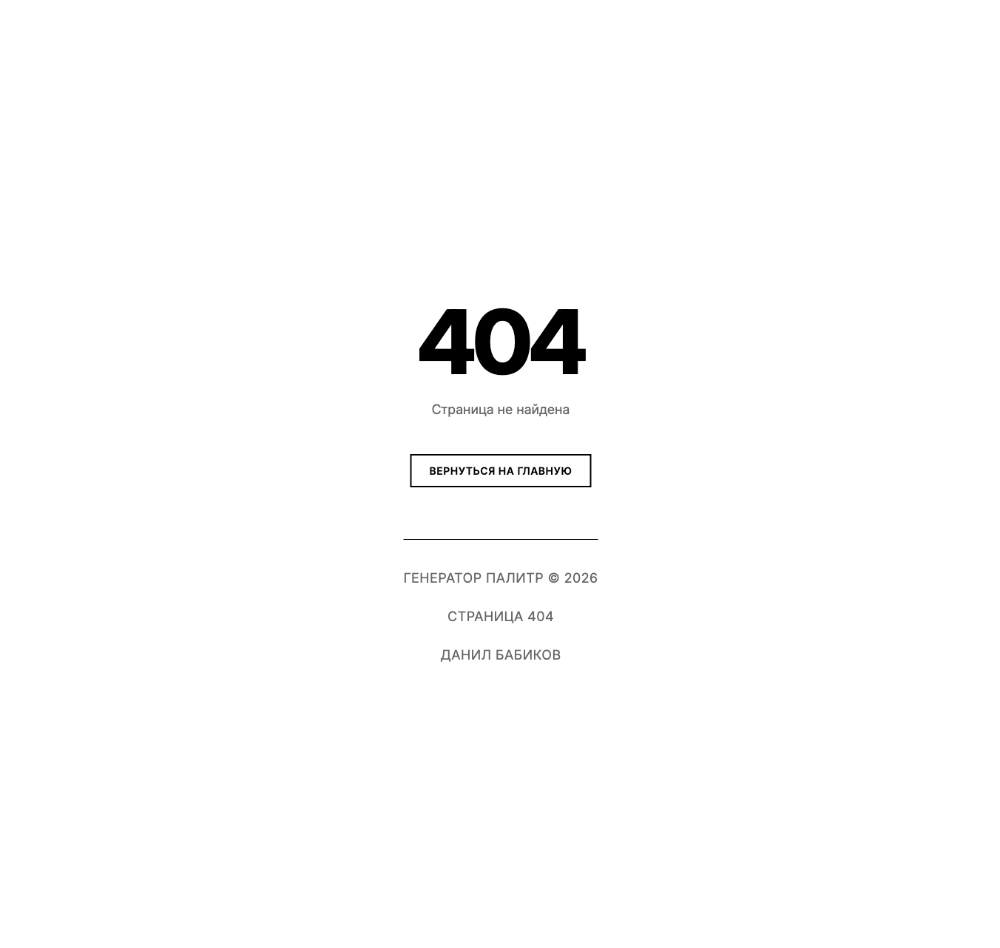
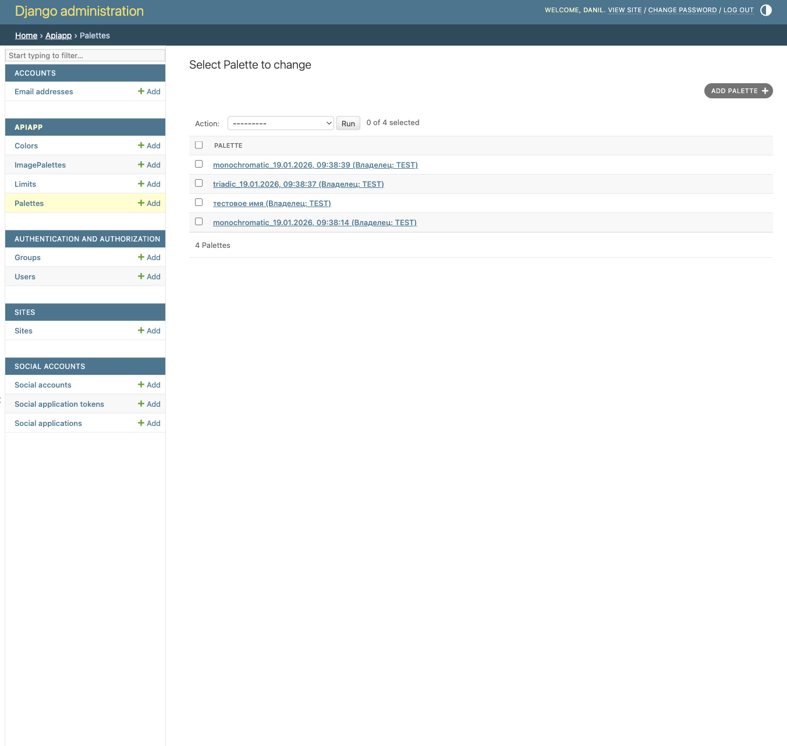
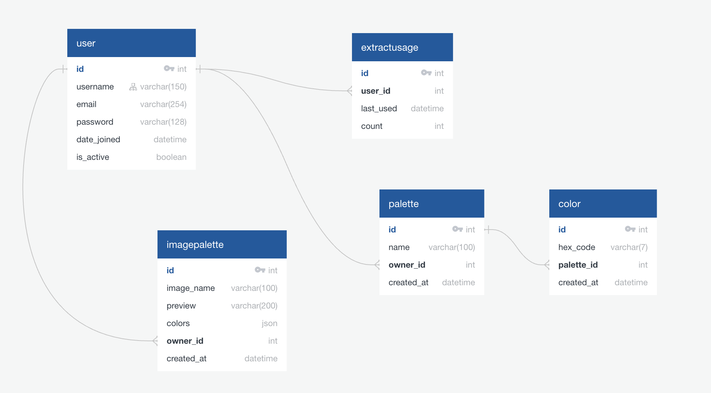

# Генератор Палитр

Сервис для создания и сохранения цветовых палитр на основе заданного цвета или загруженного изображения. Позволяет генерировать монохромные, аналоговые, комплементарные и триадные палитры, а также извлекать доминирующие цвета из фотографий

**Ссылка на рабочий проект:** https://danilbabikov.pythonanywhere.com


## Технологии
**Backend**
* **Python 3.10**
* **Django 4.2** + Django REST Framework
* **База данных:** SQLite

**Обработка данных**
* **Pillow** — работа с изображениями
* **scikit-learn** — кластеризация цветов (K-Means)
* **NumPy** — числовые вычисления

**Frontend**
* **Чистый CSS** с адаптивным дизайном
* **JavaScript** — динамические запросы
* **Google Fonts** — шрифт Inter

**Хостинг:** PythonAnywhere
**Аутентификация:** OAuth 2.0 (Google)


## Скриншоты

### Главная страница - генератор палитр

*Выбор цвета и генерация 4 типов палитр*

### Извлечение цветов из изображения

*Загрузка изображения и извлечение цветовой палитры*

### Сохраненные палитры

*Вкладка с сохраненными палитрами*

### Сохраненные изображения

*Вкладка с сохраненными изображениями*

### Страница 404

*Страница 404*

### Админ-панель

*Управление пользователями и палитрами*

### База данных

*База данных*


## Возможности
* Генерация 4 типов цветовых палитр по HEX-коду
* Извлечение доминирующих цветов из изображений
* Сохранение палитр в личном кабинете
* Получение названия цвета по HEX-коду(*api/color/name/?color=*)
* Копирование цветов и палитр в буфер обмена
* Ограничение запросов (защита от злоупотребления)


## Как запустить проект локально
1. **Клонируйте репозиторий:**
    ```bash
    git clone https://github.com/DanilBabikov0/python_tp_project.git
    cd python_tp_project
    ```
2. **Создайте и активируйте виртуальное окружение:**
   ```bash
   python -m venv venv
   source venv/bin/activate  # для Linux/Mac
   venv\Scripts\activate     # для Windows
   ```
3. **Установите зависимости:**
   ```bash
   pip install -r requirements.txt
   ```
4. **Выполните миграции:**
   ```bash
   python manage.py migrate
   ```
5. **Соберите статические файлы:**
    ```bash
    python manage.py collectstatic
    ```
6. **(Опционально) Создайте суперпользователя:**
    ```bash
    python manage.py createsuperuser
    ```
7. **Запустите сервер:**
   ```bash
   python manage.py runserver
   ```
8. **Откройте проект в браузере:**
   Перейдите по ссылке: http://127.0.0.1:8000/

    
### Авторизация
Для полного функционала (сохранение палитр, извлечение цветов из изображений) требуется регистрация через Google. Настроить OAuth можно в Google Cloud Console.
Для продакшена заведите переменные (*SECRET_KEY*, *DEBUG=False*, *ALLOWED_HOSTS*)